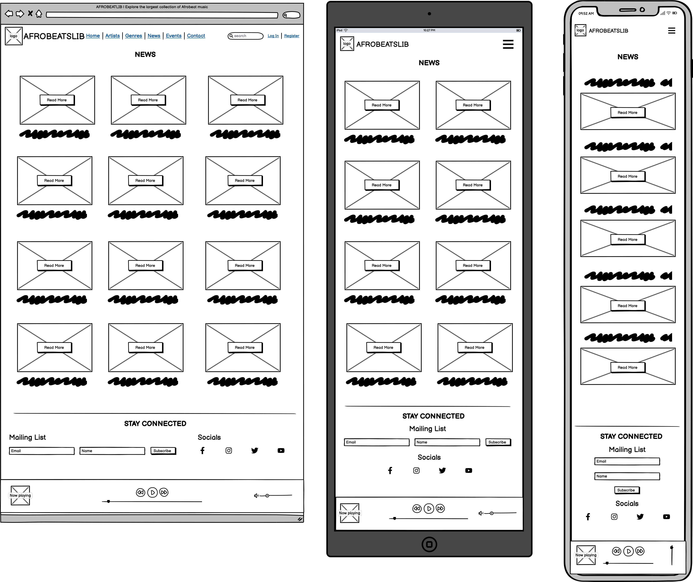
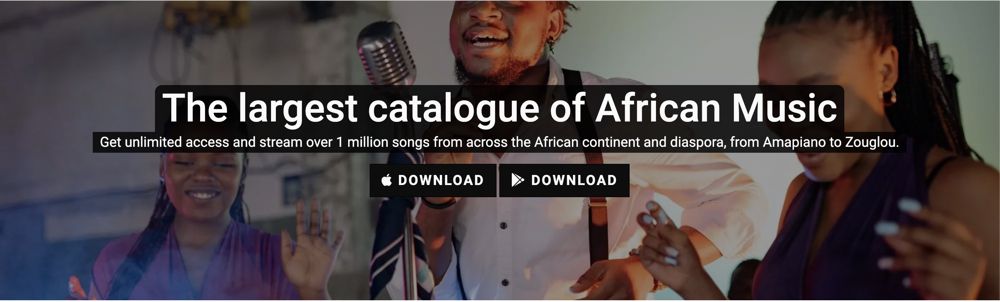
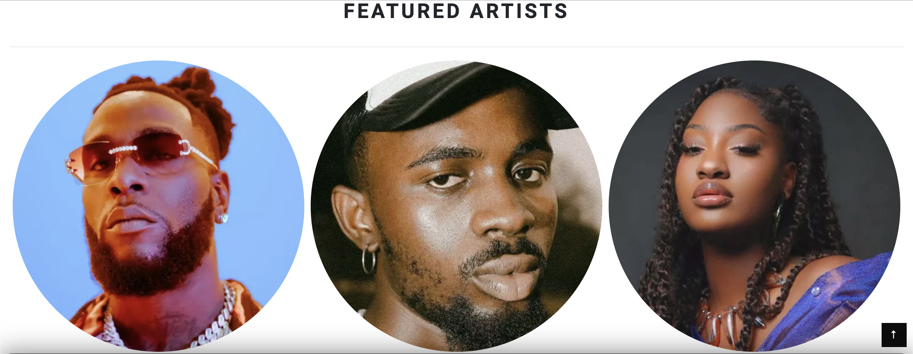
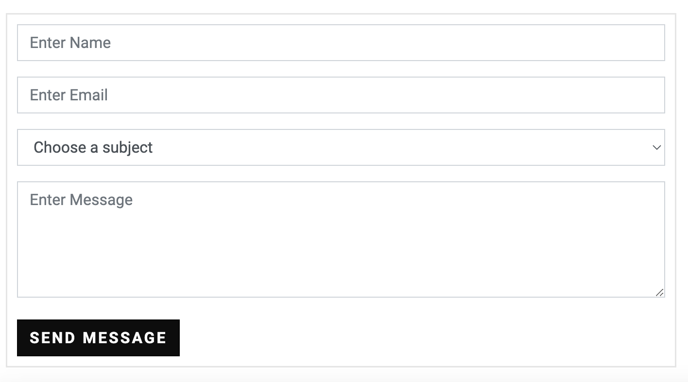
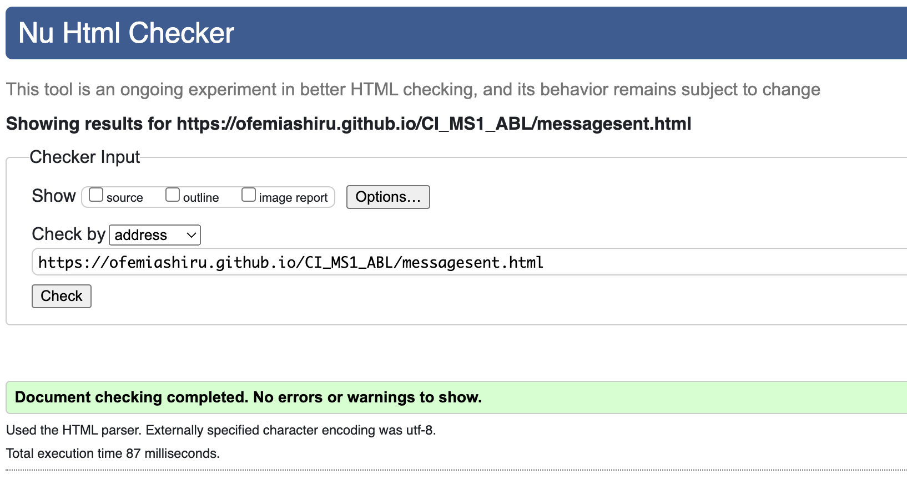
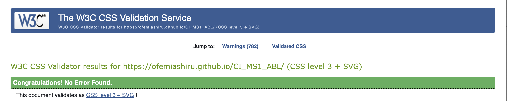
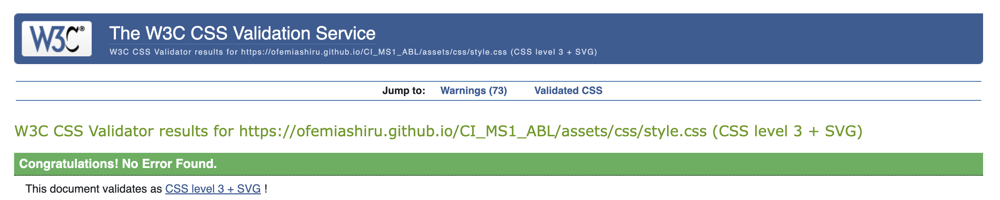
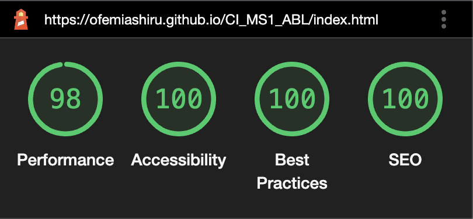
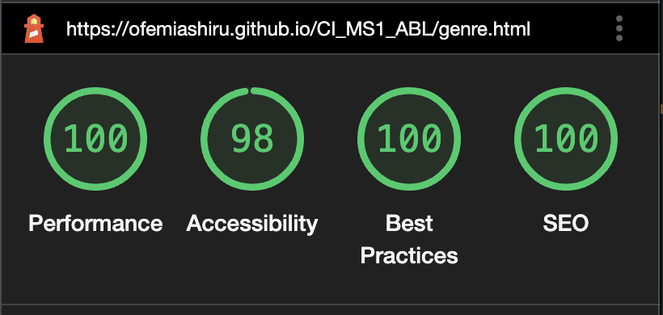
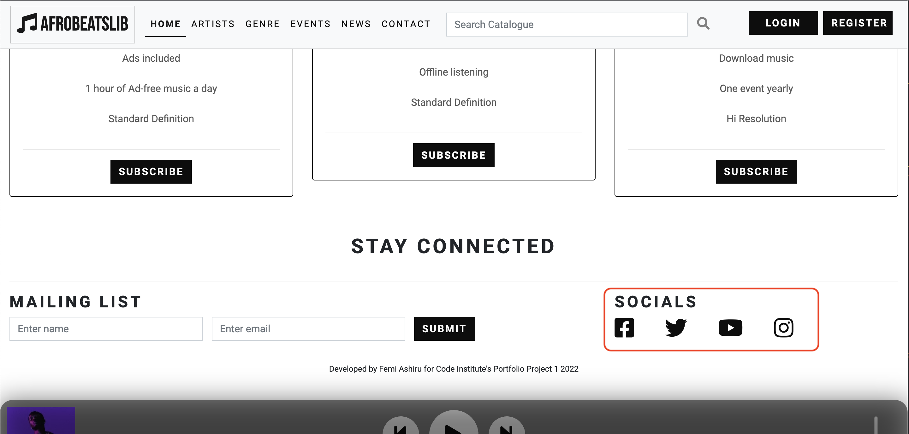

# AfrobeatsLib
(Developer: Femi Ashiru)


[Live Project](https://ofemiashiru.github.io/CI_MS1_ABL)

## Table of Content

1. [Project Goals](#project-goals)
    1. [User Goals](#user-goals)
    2. [Site Owner Goals](#site-owner-goals)
2. [User Experience](#user-experience)
    1. [Target Audience](#target-audience)
    2. [User Requrements and Expectations](#user-requrements-and-expectations)
    3. [User Stories](#user-stories)
    4. [Scope](#scope)
3. [Design](#design)
    1. [Design Choices](#design-choices)
    2. [Colour](#colour)
    3. [Fonts](#fonts)
    4. [Structure](#structure)
    5. [Wireframes](#wireframes)
4. [Technologies Used](#technologies-used)
    1. [Languages](#languages)
    2. [Frameworks and Tools](#frameworks-and-tools)
5. [Features](#features)
6. [Testing](#validation)
    1. [HTML Validation](#HTML-validation)
    2. [CSS Validation](#CSS-validation)
    3. [Accessibility](#accessibility)
    4. [Performance](#performance)
    5. [Responsiveness](#responsiveness)
    6. [Device testing](#performing-tests-on-various-devices)
    7. [Browser compatibility](#browser-compatability)
    8. [Testing user stories](#testing-user-stories) 
8. [Bugs](#Bugs)
9. [Deployment](#deployment)
10. [Credits](#credits)
11. [Acknowledgements](#acknowledgements)


## Project Goals 

### User Goals
- Link to the latest music from their favourite Afrobeats artists
- See the different options and costs for subscribing to AfrobeatsLib
- Browse artists by letter or genre
- Read latest news about everything relating to Afrobeats music
- See the latest Afrobeats events and link to their corresponding pages

### Site Owner Goals
- Have fans and artist subscribe to AfrobeatsLib
- Collect emails of visitors to grow AfrobeatsLib mailing list
- Enable visitors to contact AfrobeatsLib with queries relating to sales, technical issues etc.
- Provide a way for visitors to download the AfrobeatsLib app via the App store or Goolge Play store
- Prepare site to implement it's own in house music player (currently disabled)

## User Experience

### Target Audience
- People who are fans of Afrobeat music 
- Independent or major Artists who would like to upload their own music
- People who would like to be kept up to date with the most recent Afrobeat news and events

### User Requrements and Expectations

- Easy to use navigation that is responsive
- Be able to easily browse artists by genre or letter
- All links to work as expected
- Appealing design that works well on both desktop and mobile devices
- Be able to connect easily with events and news
- Be able to contact AfrobeatsLib in a simple way
- Gain information about the different subscriptions quickly and easily
- Accessibility 

### User Stories

#### First-time User 
1. I want to locate favourite artists by letter or genre
2. I want to know the different subscription prices
3. I want to see the latest events 
4. I want to see the latest news
5. I want to be able to download the AfrobeatsLib app from the App store or Google Play store
6. I want to be able to sign up to AfrobeatsLib
7. I want to sign up to AfrobeatsLib Mailing list

#### Returning User
8. I want to see all the latest events and be able to visit their corresponding pages
9. I want to see the latest featured albums and artists
10. I want to be able to contact AfrobeatsLib
11. I want to interact with AfrobeatsLib on their social media platform
12. I want to leave a comment on the news articles

#### Site Owner 
13. I want users to be able to find and listen to their favourite Afrobeats artists
14. I want users to be able to be kept up to date with latest events and news
15. I want users to be able to contact us
16. I want users to be able to download our app on App store and Google Play store
17. I want users to sign up to our mailing list
18. I want our site to be prepared to launch our own in house music player 

## Scope

The scope of the project in it’s first release is defined by the following features:

- Simple navigation that clearly shows the user what page they are currently on.  
- A footer on all pages that allows users to sign up to the mailing list and connect to social media platforms.
- A detailed section on the home page (index.html) that shows the pricing for subscribing to the websites services.
- Login and register links on all pages that display a modal to allow users to register or login.
- Artist (artists.html) and genre (genre.html) page that allows users to browse artists by letter or genre.
- Link to external YouTube site for each artists music, making sure that the page opens in a new tab/window. 
- Contact page with form to allow users to send queries. The form is functional and will not submit unless all fields are filled out.
- An error page (404.html) that directs users back to the previous page they were on if visiting a page that does not exist.
- An Events page (events.html) that allows users to see the latest events and navigate to their respective pages.
- A News page (news.html) that shows all the latest news.
- Google map embedded to display the location of the sites business office.
- Clear and simple favicon icon to help users identify the site.

Features to be built in future releases:

- In house music player, which is currently disabled, will be developed so that artist links will trigger the player instead of navigating to a YouTube link.
- Currently the comments form on each article navigates to a placeholder - this will be developed to display comments under each article.
- Search bar on navigation will be developed to help users quickly explore the catalogue of music on website.
- Develop login and register modals to store users details and subscription information in a database. This will also lead to a users account page being developed based on whether users are artists or fans.
- Mailing list form will successfully store visitors emails within a database for future alerts.

## Design

### Design Choices
AfrobeatsLib was designed to have a simple and sleek modern look that is able to compete with other streaming platforms on the market. It has modern edges with a simple colour scheme which also makes it easy for users to navigate throughout the site. As the site adopts the usage of a lot of images, it was important to make sure not to introduce too many colours for the scheme as it could potentially clash. The look of the site resembles high end music magazines with large images and minimal amounts of text.

### Colour

For the colour scheme I opted for a simple shade of black and off white colour using a chalk tone for the majority of the body text. The bright pink was chosen to give familiarity to Apple Music and TikTok platforms as a way of aligning to them as potential competitors.


### Fonts

The main body of the text uses Roboto with a fallback of sans-serif, however the brand text adopts the Bebas Neue font also with a fallback of sans-serif. The headings use a heavier font weight of Roboto throughout the site. Both fonts were imported using Google Fonts API.

### Structure
The website is structured to mimick the style of high end magazines with a simple top down, left to right flow of information. It is user friendly and has recognisable elements such as a fixed navigation bar along the top that consists of the business brand logo, menu for each page, search bar and login & register buttons. Each page is responsive in nature and has been tested on the industry standard width of 320px.

The website consists of 6 main pages:
- Home page which shows what the site is about, featured albums, and the various subscription options
- Artist page which allows users to browse the artist they want to listen to by letter and shows the top three featured artists
- Genre page which allows users to browse the artist they want to listen to by genre
- Events page which allows users to see the latest events and navigate to their corresponding sites
- News page which allows users to see and keep up with the latest news
- Contact page which allows users to contact the business and locate the office

### Wireframes

<details><summary>Home</summary>

</details>
<details><summary>Artists</summary>

</details>
<details><summary>Genre</summary>
 
</details>
<details><summary>Events</summary>

</details>
<details><summary>News</summary>

</details>
<details><summary>News - Each Article</summary>

</details>
<details><summary>Contact</summary>

</details>

## Technologies Used

### Languages
- HTML
- CSS

### Frameworks and Tools
- Bootstrap v4.5
- Git
- GitHub
- Gitpod
- TinyURL
- Ezgif<span>.</span>com
- Balsamiq
- Google Fonts
- Adobe Color
- Font Awesome
- Favicon<span>.</span>io

## Features

### Logo Navigation and Search bar
- Navigation and Logo remains consistent on each page
- Navigation is fully responsive and collapses when window is resized
- Navigation allows users to easily navigate from page to page
- Logo in Navigation takes user back to the home page
- Navigation also contains a search bar which will be an additional feature in future iterations of the site
- Navigation indicates to user what page they are currently on


### Login and Register Modals
- Allow users to login and/or register to AfrobeatsLib
- This will be a feature that will be developed in future iterations


### Hero Section
- Informs user of what the site is about
- Allows user to download app on App store or Google Play store (User story - 5, 16)



### Featured Albums and Artists
- Informs user of the latest feature albums and artists (User story - 9) 




### Subscriptions
- Informs users of the subscription pricing (User story - 2, 6)


### Footer
- Features on all pages
- Consists of two sections, mailing list and social media links
- User story - 7, 11, 17


### Music Player
- Features on all pages
- In house music player ready for development for future iterations of the site (currently disabled)
- User story - 18


### Artists
- Allows users to browse artist by letter (User story - 1, 13)


### Genre
- Allows users to browse artust by genre (User story - 1, 13)


### Events
- Allow users to see latest events and navigate to their respective pages (User story - 3, 8, 14)


### News and News - Each Article
- Allow users to see the latest news (User story 4, 14)


### Comment on Article
- Allow users to leave a comment on article (User story - 12)


### Contact
- Allow users to contact AfrobeatsLib (User story - 10, 15)



### Map
- Allow users to be able to locate the business office


## Validation

### HTML Validation
The W3C Markup Validation Service was used to validate the HTML of the website. 
All pages pass with no errors and no warnings.
<details><summary>Home</summary>

</details>
<details><summary>Artists</summary>

</details>
<details><summary>Genre</summary>

</details>
<details><summary>Events</summary>

</details>
<details><summary>News</summary>

</details>
<details><summary>News Article Pages</summary>


</details>
<details><summary>Contact</summary>

</details>
<details><summary>404</summary>

</details>
<details><summary>Message Sent</summary>

</details>
<details><summary>Coming Soon</summary>

</details>

### CSS Validation
The W3C Jigsaw CSS Validation Service was used to validate the CSS of the website.
After testing the whole sites CSS and my own custom CSS all pages passed with no errors, however, there were a number of warnings present that were related to the webkit css extensions used.
<details><summary>whole site</summary>

</details>
<details><summary>custom css (style.css)</summary>

</details>

### Accessibility
The WAVE WebAIM web accessibility tool was used to ensure the website met accessibility standards. 
<details><summary>Home</summary>
<p>No errors</p>

</details>
<details><summary>Artists</summary>
<p>No errors. 1 Alert due to index.html being referenced twice on logo and home link</p>

</details>
<details><summary>Genre</summary>
<p>No errors. 1 Alert due to index.html being referenced twice on logo and home link</p>

</details>
<details><summary>Events</summary>
<p>No errors. 1 Alert due to index.html being referenced twice on logo and home link</p>

</details>
<details><summary>News</summary>
<p>No errors. 1 Alert due to index.html being referenced twice on logo and home link</p>

</details>
<details><summary>News - Each Article</summary>
<p>No errors. 1 Alert due to index.html being referenced twice on logo and home link</p>


</details>
<details><summary>Contact</summary>
<p>No errors. 1 Alert due to index.html being referenced twice on logo and home link</p>

</details>

### Performance 
Google Lighthouse Tool was used to test the performance of the website. 
<details><summary>Home</summary>

</details>
<details><summary>Artists</summary>

</details>
<details><summary>Genre</summary>

</details>
<details><summary>Events</summary>

</details>
<details><summary>News</summary>

</details>
<details><summary>News - Each Article</summary>


</details>
<details><summary>Contact</summary>

</details>

### Performing tests on various devices 
The website was tested on the following devices:
- Apple Macbook Pro M1
- Apple iPhone 11
- Xiaomi Mi 11 Lite

### Browser compatability
The website was tested on the following browsers:
- Google Chrome
- Safari
- Mozilla Firefox
- Microsoft Edge

### Responsiveness

<details><summary>Mobile</summary>
<video controls>
<source src="docs/responsiveness/responsiveness-mobile.mp4" type="video/mp4">
Your browser does not support the video tag.
</video>
</details>

<details><summary>Tablet</summary>
<video controls>
<source src="docs/responsiveness/responsiveness-tablet.mp4" type="video/mp4">
Your browser does not support the video tag.
</video>
</details>

<details><summary>Desktop</summary>
<video controls>
<source src="docs/responsiveness/responsiveness-desktop.mp4" type="video/mp4">
Your browser does not support the video tag.
</video>
</details>


### Testing user stories

1. I want to locate favourite artists by letter or genre

| **Feature** | **Action** | **Expected Result** | **Actual Result** |
|-------------|------------|---------------------|-------------------|
| Artists and Genre Page | Navigate to Artists or Genre page and use letter or genre links to locate artist | Page opens and links successfully narrow down location of artist | Works as expected |

<details><summary>Screenshots</summary>
<p>Artists</p>

<p>Genre</p>

</details>

2. I want to know the different subscription prices

| **Feature** | **Action** | **Expected Result** | **Actual Result** |
|-------------|------------|---------------------|-------------------|
| Home Page | Scroll down to the subscriptions section and observe prices | Page scrolls to desired section and prices clearly visible | Works as expected |

<details><summary>Screenshots</summary>

</details>

3. I want to see the latest events

| **Feature** | **Action** | **Expected Result** | **Actual Result** |
|-------------|------------|---------------------|-------------------|
| Events Page | Navigate to Events page and hover over desired events revealing info | Page opens and each event reveals info when hovered over | Works as expected |

<details><summary>Screenshots</summary>

</details>

4. I want to see the latest news

| **Feature** | **Action** | **Expected Result** | **Actual Result** |
|-------------|------------|---------------------|-------------------|
| News Page | Navigate to News page and click article | Page opens and shows all news, each article navigates to relevant article | Works as expected |

<details><summary>Screenshots</summary>


</details>


5. I want to be able to download the AfrobeatsLib app from the App store or Google Play store

| **Feature** | **Action** | **Expected Result** | **Actual Result** |
|-------------|------------|---------------------|-------------------|
| Hero Section | Click on App store and Google Play buttons | Buttons should open new tab with relevant store | Works as expected |

<details><summary>Screenshots</summary>

</details>

6. I want to be able to sign up to AfrobeatsLib

| **Feature** | **Action** | **Expected Result** | **Actual Result** |
|-------------|------------|---------------------|-------------------|
| Navigation Bar | Click on Login or Register buttons| Buttons should open up modals for Login and Register | Works as expected |

<details><summary>Screenshots</summary>

</details>

7. I want to sign up to AfrobeatsLib Mailing list

| **Feature** | **Action** | **Expected Result** | **Actual Result** |
|-------------|------------|---------------------|-------------------|
| Stay Connected section on all pages/Footer| Fill in input boxes and click submit| Input boxes submitted only when both are filled in and opens response page | Works as expected |

<details><summary>Screenshots</summary>

</details>


8. I want to see all the latest events and be able to visit their corresponding pages

| **Feature** | **Action** | **Expected Result** | **Actual Result** |
|-------------|------------|---------------------|-------------------|
| Events Page| Click on each event| Each event should open new tab with corresponding event | Works as expected |

<details><summary>Screenshots</summary>

</details>

9. I want to see the latest featured albums and artists

| **Feature** | **Action** | **Expected Result** | **Actual Result** |
|-------------|------------|---------------------|-------------------|
| Home Page and Artists Page| Click on page link to reveal featured albums and artists at top of page| Featured albums and artists should appear and be able to be clicked to navigate to corresponding album/artist | Works as expected |

<details><summary>Screenshots</summary>
<p>Featured Albums</p>

<p>Featured Artists</p>

</details>

10. I want to be able to contact AfrobeatsLib

| **Feature** | **Action** | **Expected Result** | **Actual Result** |
|-------------|------------|---------------------|-------------------|
| Contact Page| Click on contact page link enter information and click send message| Input boxes submitted only when all are filled in and opens response page | Works as expected |

<details><summary>Screenshots</summary>

</details>

11. I want to interact with AfrobeatsLib on their social media platform

| **Feature** | **Action** | **Expected Result** | **Actual Result** |
|-------------|------------|---------------------|-------------------|
| Stay Connected section on all pages/Footer| Click on social media links| Social media links should open new tabs with relevant link | Works as expected |

<details><summary>Screenshots</summary>

</details>

12. I want to leave a comment on the news articles

| **Feature** | **Action** | **Expected Result** | **Actual Result** |
|-------------|------------|---------------------|-------------------|
| News - Each article page| Click link to view artcle, scroll down, enter information and click post comment| Input boxes submitted only when all are filled in and opens response page | Works as expected |

<details><summary>Screenshots</summary>


</details>


13. I want users to be able to find and listen to their favourite Afrobeats artists

| **Feature** | **Action** | **Expected Result** | **Actual Result** |
|-------------|------------|---------------------|-------------------|
| Artists and Genre Page | Navigate to Artists or Genre page and use letter or genre links to locate artist | Page opens and links successfully narrow down location of artist | Works as expected |

<details><summary>Screenshots</summary>
<p>Artists</p>

<p>Genre</p>

</details>

14. I want users to be able to be kept up to date with latest events and news

| **Feature** | **Action** | **Expected Result** | **Actual Result** |
|-------------|------------|---------------------|-------------------|
| News Page | Navigate to News page and click article | Page opens and shows all news, each article navigates to relevant article | Works as expected |

<details><summary>Screenshots</summary>


</details>


| **Feature** | **Action** | **Expected Result** | **Actual Result** |
|-------------|------------|---------------------|-------------------|
| Events Page | Navigate to Events page and hover over desired events revealing info | Page opens and each event reveals info when hovered over | Works as expected |

<details><summary>Screenshots</summary>

</details>

15. I want users to be able to contact us

| **Feature** | **Action** | **Expected Result** | **Actual Result** |
|-------------|------------|---------------------|-------------------|
| Contact Page| Click on contact page link enter information and click send message| Input boxes submitted only when all are filled in and opens response page | Works as expected |

<details><summary>Screenshots</summary>

</details>

16. I want users to be able to download our app on App store and Google Play store

| **Feature** | **Action** | **Expected Result** | **Actual Result** |
|-------------|------------|---------------------|-------------------|
| Hero Section | Click on App store and Google Play buttons | Buttons should open new tab with relevant store | Works as expected |

<details><summary>Screenshots</summary>

</details>

17. I want users to sign up to our mailing list

| **Feature** | **Action** | **Expected Result** | **Actual Result** |
|-------------|------------|---------------------|-------------------|
| Stay Connected section on all pages/Footer| Fill in input boxes and click submit| Input boxes submitted only when both are filled in and opens response page | Works as expected |

<details><summary>Screenshots</summary>

</details>

18. I want our site to be prepared to launch our own in house music player 

| **Feature** | **Action** | **Expected Result** | **Actual Result** |
|-------------|------------|---------------------|-------------------|
| Music Player fixed at the bottom on all pages| Check all pages to see if Music player is present| All pages should have the Music Player present but disabled ready for future implementation | Works as expected |

<details><summary>Screenshots</summary>

</details>


## Bugs
| **Bug** | **Fix** | 
|-------------|------------|
| 4 contrast errors when testing on WAVE webaim Highlighting the social links spans as the issue on all pages <br> ```<span class="sr-only">Facebook</span>``` <br> ```<span class="sr-only">Twitter</span>``` <br> ```<span class="sr-only">YouTube</span>``` <br> ```<span class="sr-only">Instagram</span>```| Removed each span and placed aria-label attributes within each parent anchor tag <br> ```<a href="https://www.facebook.com" target="_blank" aria-label="Facebook"><i class="fab fa-facebook-square"></i></a>```| 
| Alerts on WAVE webaim highlighting the use of YouTube Links in featured albums section on index.html| Used TinyUrl to shorten links and update links on feature albums section| 
| Alerts on WAVE webaim highlighting the skipping of headings on index.html| Changed headings from h5 to h1 on modals | 
| Alerts on WAVE webaim highlighting missing fieldset around checkboxes or radio buttons on modals| Added fieldset and legend to the register modals around the radio buttons| 
| Alerts on WAVE webaim highlighting the use of long alternative text on news.html| Shortened the alt text on news.html images| 
| 1 contrast error when testing on WAVE webaim Highlighting the author and date as the issue| Changed the colour of the published-by class to a darker shade of grey|
| Alerts on WAVE webaim highlighting the use of justified text| Changed body of each article to align left| 

## Deployment

Deployed using GitHub Pages using the following steps:
1. Whilst in GitHub repository navigate to the Settings tab
2. On the left hand menu select Pages
3. Scroll to "Branch" tap none to show the different options and select "main"
4. Click save and the site will be published. You will see "Your site is live at https://ofemiashiru.github.io/CI_MS1_ABL/"

You can also fork the repository by:
1. Navigating to the GitHub repository
2. Click on "Fork" button in top right hand corner (Please note you must be signed in to Fork a repository)

You can clone the repository by:
1. Navigating to GitHub repository 
2. Locate the "Code" button above the file list and click it 
3. Select if you prefer to clone using HTTPS, SSH, or Github CLI and click the copy button to copy the URL to your clipboard
4. Open Git Bash
5. Change the current working directory to where you wish to clone the directory
6. Type ```git clone``` and paste in the URL from the clipboard e.g ```$ git clone https://github.com/YOUR-USERNAME/YOUR-REPOSITORY)```
7. Press Enter to create your local clone in your chosen folder.

## Credits
Images not referenced below are owned by the Developer.

### Media

[Hero image](assets/images/pexels-yan-krukov-9008836.webp) on index.html, taken from [Pexels.com](https://www.pexels.com/photo/a-man-between-women-singing-and-dancing-on-the-stage-9008836/)

The following images used for Featured Albums section on index.html, taken from [Uproxx.com](https://uproxx.com/music/best-afrobeats-albums-2022-list/)

- [Black Sherif album cover](assets/images/featured_songs/black-sherif-the-villain-i-never-was.webp)

- [Asake album cover](assets/images/featured_songs/asake.webp)

- [Burna Boy album cover](assets/images/featured_songs/burna-boy-love-damini-large.webp)

- [Naira Marley album cover](assets/images/featured_songs/naira-marley-gods-timing-the-best-copy.webp)

- [Blaq Bonez album cover](assets/images/featured_songs/blaqbonez-young-preacher.webp)

- [Adekunle Gold album cover](assets/images/featured_songs/adekunle-gold-catch-me-if-you-can.webp)

[Left middle image](assets/images/afro_nation_2019.webp) on index.html, taken from [Tiketmaster.co.uk](https://discover.ticketmaster.co.uk/music/photos-afro-nation-portugal-46269/)

[Music player image](assets/images/wizkid-more-love-less-ego.webp) on all pages, taken from [Uproxx.com](https://uproxx.com/music/best-afrobeats-albums-2022-list/)

The following images were used for artists.html and genre.html:

- [9ice](assets/images/artists/9ice.webp) taken from [Bellanaija.com](https://www.bellanaija.com/2017/06/9ice-debuts-new-look-new-photos/)

- [2Baba](assets/images/artists/2baba.webp) taken from [Okaymusic.com](https://okaymusic.com/collections/2baba)

- [Adekunle Gold](assets/images/artists/adekunle-gold.webp) taken from [Hungertv.com](https://www.hungertv.com/editorial/5-minutes-with-adekunle-gold-the-nigerian-afropop-singer-quitting-his-nine-to-five-to-pursue-music/)

- [Adewale Ayuba](assets/images/artists/adewale-ayuba.webp) taken from [Justnews.ng](https://justnews.ng/toast-to-corporate-fuji-singer-adewale-ayuba-as-he-turns-55/)

- [Asake](assets/images/artists/asake.webp) taken from [Biographyweb.org](https://www.biographyweb.org/artists/asake/)

- [Ayra Starr](assets/images/artists/ayra-starr.webp) taken from [Wikipedia.org](https://en.wikipedia.org/wiki/Ayra_Starr)

- [Bayanni](assets/images/artists/bayanni.webp) taken from [Musictown.com.ng](https://musictown.com.ng/bayanni-biography-real-name-songs-albums/)

- [Black Sherif](assets/images/artists/black-sherif.webp) taken from [Okayafrica.com](https://okayafrica.com/black-sherif-ghana-interview/)

- [Burna Boy](assets/images/artists/burna-boy.webp) taken from [Teenvogue.com](https://www.teenvogue.com/story/5-best-new-songs-this-week-burna-boy-doechii-emotional-oranges-and-more)

- [Cina Soul](assets/images/artists/cina-soul.webp) taken from [Musicinafrica.net](https://www.musicinafrica.net/directory/cina-soul)

- [C. K. Mann](assets/images/artists/ck-mann.webp) taken from [Mrbongo.bandcamp.com](https://mrbongo.bandcamp.com/album/funky-highlife)

- [Davido](assets/images/artists/davido.webp) taken from [Theguardian.com](https://www.theguardian.com/music/2020/dec/01/davido-nigerian-pop-star-fem-end-sars)

- [D’Banj](assets/images/artists/dbanj.webp) taken from [Lindaikejisblog.com](https://www.lindaikejisblog.com/2022/12/dbanjs-lawyer-issues-statement-following-singers-arrest-and-detention.html)

- [Don jazzy](assets/images/artists/don-jazzy.webp) taken from [Twitter.com](https://twitter.com/mobilepunch/status/1596564069389156359)

- [Ebenezer Obey](assets/images/artists/ebenezer-obey.webp) taken from [Leon Morris/Redferns](http://t1.gstatic.com/licensed-image?q=tbn:ANd9GcRLbOKGManzKI2mM5GdISJB8iW6-cfrF7PdWGvvlOs6sQAac09HgpSXKpD9-aCu4Ef-4O5N0xpn7oAeGcw)

- [Fela Kuti](assets/images/artists/fela-kuti.webp) taken from [Bbc.co.uk](https://www.bbc.co.uk/programmes/articles/4K2RG0drxmnrvZl17YqFGjk/the-global-legacy-of-fela-kuti-s-defiant-dance-music)

- [Femi Kuti](assets/images/artists/femi-kuti.webp) taken from [Theworld.org](https://theworld.org/stories/2021-04-12/femi-kuti-and-made-kuti-continue-afrobeat-legacy-two-part-album)

- [Fireboy DML](assets/images/artists/fireboy-dml.webp) taken from [Pitchfork.com](https://pitchfork.com/news/listen-to-fireboy-dml-new-song-bandana/)

- [Fuse ODG](assets/images/artists/fuse-odg.webp) taken from [Theguardian.com](https://www.theguardian.com/music/2019/mar/07/afrobeats-star-fuse-odg-i-love-myself-now-africa-has-done-that-for-me)

- [Genevieve Nnaji](assets/images/artists/genevieve-nnaji.webp) taken from [Selahafrik.com](https://www.selahafrik.com/2022/03/genevieve-nnaji-mental-health/)
 
- [Gyakie](assets/images/artists/gyakie.webp) taken from [Unorthodoxreviews.com](https://www.unorthodoxreviews.com/next-up-gyakie/)

- [Harrysong](assets/images/artists/harrysong.webp) taken from [Plugged.co.ke](https://www.plugged.co.ke/nigerian-star-harrysong-teams-up-with-fireboy-dml-and-olamide-releasing-she-knows/)

- [Humblesmith](assets/images/artists/humblesmith.webp) taken from [Starzone.com.ng](https://www.starzone.com.ng/wp-content/uploads/2022/01/FB_IMG_16406099148407597.jpg)

- [Ice Prince](assets/images/artists/ice-prince.webp) taken from [Nataal.com](https://nataal.com/ice-prince)

- [Iyanya](assets/images/artists/iyanya.webp) taken from [Audiomack.com](https://audiomack.com/iyanya)

- [Joeboy](assets/images/artists/joeboy.webp) taken from [Wikipedia.org](https://en.wikipedia.org/wiki/Joeboy)

- [K1 De Ultimate](assets/images/artists/k1-de-ultimate.webp) takend from [Wikipedia.org](https://en.wikipedia.org/wiki/K1_De_Ultimate)

- [Kcee](assets/images/artists/kcee.webp) taken from [Audiomack.com](https://audiomack.com/badmankcee)

- [King Sunny Ade](assets/images/artists/king-sunny-ade.webp) taken from [Dailypost.ng](https://dailypost.ng/2015/04/28/juju-musician-king-sunny-ade-bereaved-loses-manager/)

- [Kizz Daniel](assets/images/artists/kizz-daniel.webp) taken from [21stcenturychronicle.com](https://21stcenturychronicle.com/kizz-daniel-drops-new-anthem-odo/)

- [Korede Bello](assets/images/artists/korede-bello.webp) taken from [Trendybeatz.com](https://trendybeatz.com/music-news/449/%E2%80%9Cmoney-and-fame-is-not-the-answer-to-everything%E2%80%9D-%E2%80%93-korede-bello)


- [Ladipoe](assets/images/artists/ladipoe.webp) taken from [Pitchfork](https://pitchfork.com/news/listen-to-ladipoes-new-ep-featuring-amaarae-rema-and-fireboy-dml/)

- [Ladysmith Black Mambazo](assets/images/artists/ladysmith-b-mambazo.webp) taken from [Tolitasmusings.blogspot.com](https://tolitasmusings.blogspot.com/2011/05/live-review-ladysmith-black-mambazo.html)

- [Lágbájá](assets/images/artists/lagbaja.webp) taken from [Greedyforbestmusic.com](https://www.greedyforbestmusic.com/journal/friends/lagbaja/)

- [Magic System](assets/images/artists/magic-system.webp) taken from [Mla-agency.com](https://mla-agency.com/wp-content/uploads/2022/07/magic-system.jpeg)

- [Magixx](assets/images/artists/magixx.webp) taken from [Mixmag.net](https://mixmag.net/feature/get-to-know-magixx-interview-nigeria-lagos-afrobeat-afropop)

- [Major League DJz](assets/images/artists/majorleaguedjz.webp) taken from [Grmdaily.com](https://grmdaily.com/major-league-djz-brixton-o2-show-review/)

- [M.I](assets/images/artists/M-I.webp) taken from [Thepitldn.com](https://www.thepitldn.com/pitnews/artist-spotlight-m-i-abanga)

- [Mr Eazi](assets/images/artists/mr-eazi.webp) taken from [Justnaija.com](https://justnaija.com/music/artistes/mr-eazi/)

- [Naira Marley](assets/images/artists/naira-marley.webp) taken from [Theguardian.com](https://www.theguardian.com/music/2020/apr/08/rapper-naira-marley-ibig-bum-qualifications-nigeria-marlians)

- [Niniola](assets/images/artists/niniola.webp) taken from [Wikipedia.org](https://en.wikipedia.org/wiki/Niniola)

- [Nneka](assets/images/artists/nneka.webp) taken from [Theguardian.com](https://www.theguardian.com/music/2022/feb/13/nneka-love-supreme-sweet-sharp-and-serene)

- [Olamide](assets/images/artists/olamide.webp) taken from [Pulse.ng](https://www.pulse.ng/entertainment/music/olamide-set-to-release-new-album-uy-scuti/4gqhxek)

- [Omah Lay](assets/images/artists/omah-lay.webp) taken from [Earth-agency.com](https://earth-agency.com/artists/omah-lay/omah-lay-1/ )

- [Pheelz](assets/images/artists/pheelz.webp) taken from [Simpleonline.ng](https://digital.simpleonline.ng/pheelz-mr-producer-the-rhythm-is-cool/)

- [Plantashun Boiz](assets/images/artists/plantashun-boiz.webp) taken from [Wuzupnigeria.ng](https://wuzupnigeria.ng/entertainment/video-plantashun-boiz-perform-at-sound-sultans-memorial-as-blackface-2baba-settle-beef)

- [Rema](assets/images/artists/rema.webp) taken from [Nme.com](https://www.nme.com/blogs/nme-radar/rema-interview-afrorave-calm-down-jealousy-fka-twigs-3178061)

- [Ruger](assets/images/artists/ruger.webp) taken from [Lindaikejisblog.com](https://www.lindaikejisblog.com/2022/9/singer-ruger-throws-massive-shade-as-he-announces-his-arrival-in-tanzania.html)

- [Sade](assets/images/artists/sade.webp) taken from [Thefader](https://www.thefader.com/2015/01/16/sade-lovers-rock-cover-story-interview)

- [Seun Kuti](assets/images/artists/seun-kuti.webp) taken from [Theguardian.com](https://www.theguardian.com/world/2021/jan/19/system-rigged-seun-kuti-reviving-fela-political-party-nigeria)

- [Seyi Sodimu](assets/images/artists/seyi-sodimu.webp) taken from [Brandiconimage.com](https://www.brandiconimage.com/2012/12/seyi-sodimu-gives-wife-n10m-gl-450-benz.html)

- [Tems](assets/images/artists/tems.webp) taken from [Rca-records.co.uk](https://www.rca-records.co.uk/artists/tems)

- [Tiwa Savage](assets/images/artists/tiwa-savage.webp) taken from [Dailypost.ng](https://dailypost.ng/2016/04/28/tiwa-savage-slept-2face-don-jazzy-others-teebillz-reveals-instagram/)

- [Tony Tetuila](assets/images/artists/tony-tetuila.webp) taken from [Bellanaija.com](https://www.bellanaija.com/2018/08/tony-tetuila-loses-mom-%F0%9F%92%94/)

- [Victony](assets/images/artists/victony.webp) taken from [Livenation.co.uk](https://www.livenation.co.uk/artist-victony-1387695)

- [Wizkid](assets/images/artists/wizkid.webp) taken from [Billboard.com](https://www.billboard.com/music/chart-beat/wizkid-2-sugar-hot-trending-songs-chart-1235175682/)

- [Yemi Alade](assets/images/artists/yemi-alade.webp) taken from [Wikipedia.org](https://en.wikipedia.org/wiki/Yemi_Alade)

- [Yinka Ayefele](assets/images/artists/yinka-ayefele.webp) taken from [Newswirengr.com](https://newswirengr.com/2022/10/12/yinka-ayefele-biography-education-career-marriage-net-worth-achievements-and-controversy/)

- [Zinoleesky](assets/images/artists/zinoleesky.webp) taken from [Scala.co.uk](https://scala.co.uk/events/zinoleesky-live-at-scala/)

- [Zlatan](assets/images/artists/zlatan.webp) taken from [Thrilling.com](https://thrillng.com/zlatan-ibile-zlatan-ibiles-biography-age-songs-career-and-net-worth/)


The following images were used for events.html:

- [Love Amapiano & Afrobeats Fridays](assets/images/events/love-amapiano-and-afrobeats-fridays.webp) taken from [Eventbrite.co.uk](https://www.eventbrite.co.uk/e/love-amapiano-afrobeats-fridays-tickets-476994301797)

- [Afro Caribbean New Year's Eve Party](assets/images/events/afro-caribbean-new-years-eve-party.webp) taken from [Fatsoma.com](https://www.fatsoma.com/e/41ooc5yc/afro-caribbean-new-year-s-eve-party-at-98-club)

- [Amapiano Nights](assets/images/events/amapiano-nights.webp) taken from [Eventbrite.co.uk](https://www.eventbrite.co.uk/e/amapiano-nights-vibes-on-vibes-tickets-463993335557)

- [GROWN & SEXY Saturdays](assets/images/events/grown-and-sexy.webp) taken from [Eventbrite.co.uk](https://www.eventbrite.co.uk/e/grown-sexy-saturdays-tickets-482155910307)

- [Luxé Winter - New Years Special](assets/images/events/luxe-winter-new-years-special.webp) taken from [Eventbrite.co.uk](https://www.eventbrite.co.uk/e/luxe-winter-new-years-special-tickets-449600516247)

- [The Afrowales Explosion](assets/images/events/the-afrowales-explosion.webp) taken from [Skiddle.com](https://www.skiddle.com/whats-on/Cardiff/Revolution/The-Afrowales-Explosion/36215389/)

- [Diaspora Nights](assets/images/events/diaspora-nights.webp) taken from [Eventbrite.co.uk](https://www.eventbrite.co.uk/e/diaspora-nights-afrobeats-afrohouse-amapiano-tickets-466855045007)

- [Afrobeats VS Bashment VS Rap](assets/images/events/afrobeats-vs-bashment-vs-rap.webp) taken from [Fatsoma.com](https://www.fatsoma.com/e/dck8bwkp/afrobeats-vs-bashment-vs-rap)

- [Kojo Funds Live - AfroSupper](assets/images/events/kojo-funds-live-afrosupper.webp) taken from [Fatsoma.com](https://www.fatsoma.com/afrobeatsnbrunch/promotions/qwsavfmj/kojo-funds-live-afrosupper-surrey-jan-28th)

- [4Fingaz Live](assets/images/events/4fingaz-live.webp) taken from [Eventbrite.co.uk](https://www.eventbrite.co.uk/e/4fingaz-live-tickets-485341849537)

All news articles used on news.html and each article page sourced from [Newsnow.co.uk](https://www.newsnow.co.uk/h/Entertainment+&+Arts/Music/Afrobeats) with each coming from:

- [Article One](assets/images/news/article-one-image.webp) taken from [Bellanaija.com](https://www.bellanaija.com/2022/12/new-music-kelly-bran-ft-young-eno/)

- [Article Two](assets/images/news/article-two-image.webp) taken from [Bellanaija.com](https://www.bellanaija.com/2022/12/barack-obama-favorite-music-of-2022/)

- [Article Three](assets/images/news/article-three-image.webp) taken from [Soundcity](https://soundcity.tv/lover-boy-emo-grae-drops-new-single-freaky-ft-naira-marley/)

- [Article Four](assets/images/news/article-four-image.webp) taken from [Bellanaija.com](https://www.bellanaija.com/2022/12/oxlade-camila-cabello-kulosa-remix/)

- [Article Five](assets/images/news/article-five-image.webp) taken from [Ghanamusic.com](https://www.ghanamusic.com/news/top-stories/2022/12/09/vibe-with-sofie-sister-deborahs-new-afrobeat-single-we-dey/)

- [Article Six](assets/images/news/article-six-image.webp) taken from [Crackmagazine.net](https://crackmagazine.net/2022/12/burna-boy-releases-new-video-for-whiskey/)

- [Article Seven](assets/images/news/article-seven-image.webp) taken from [Ghanamusic.com](https://www.ghanamusic.com/news/top-stories/2022/12/19/a-sneak-peak-into-confirmed-artistes-how-your-next-door-neighbour-is-prepping-up-for-afronation-ghana/)

### Code

- [Navbar with toggle and search bar](https://getbootstrap.com/docs/4.5/components/navbar/) taken from Bootstrap 4.5

- [Modals](https://getbootstrap.com/docs/4.5/components/modal/) taken from Bootstrap 4.5

- [Cards](https://getbootstrap.com/docs/4.5/components/card/) taken from Bootstrap 4.5

- [Form compopnents](https://getbootstrap.com/docs/4.5/components/forms/) taken from Bootstrap 4.5

- Used [Developer.mozilla.org](https://developer.mozilla.org/en-US/docs/Web/CSS/transform-function/rotate) to help rotate volume input on music player

- Used [Nikitahl.com](https://nikitahl.com/style-range-input-css) to help style range input types

- Used [w3schools.com](https://www.w3schools.com/css/css3_object-fit.asp) to fit news images on news.html

- Used [oodlestechnologies.com](https://www.oodlestechnologies.com/blogs/how-to-swap-two-elements-using-css/) to help reposition .article-box-header to the top of news image on smaller screens for news.html

- Used [w3schools.com](https://www.w3schools.com/cssref/sel_before.php) and [w3schools.com](https://www.w3schools.com/cssref/sel_after.php) for greater understand of the before and after psuedo classes

- Used [Stackoverflow](https://stackoverflow.com/questions/20782368/use-font-awesome-icon-as-css-content) to use Font Awesome Icon as CSS content

- Used [Smashingmagazine.com](https://www.smashingmagazine.com/2013/08/absolute-horizontal-vertical-centering-css/) to help center absolute elements vertically and horizontally

- Used [w3schools.com](https://www.w3schools.com/howto/howto_css_blurred_background.asp) to use filter and blur backgrounds

- Used [Davidmacd.com](https://www.davidmacd.com/blog/alternate-text-for-css-background-images.html) to understand how to add alternate text to background images

- Used [Computerhope.com](https://www.computerhope.com/issues/ch000317.htm) to add a history button to 404.html, messagesent.html and comingsoon.html

- Used [Compart](https://www.compart.com/en/unicode/U+00E1) to add appropriate Unicode for artist L&#225;g&#225;j&#225;

- Used [w3schools.com](https://www.w3schools.com/tags/tag_fieldset.asp) to aid in creating a fieldset and legend for radio buttons

## Acknowledgements

I would like to take the opportunity to thank:
- Mo Shami
- Iris Smok
- and the Teaching and Non-teaching Personnel at Code Insitute