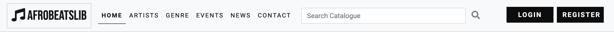
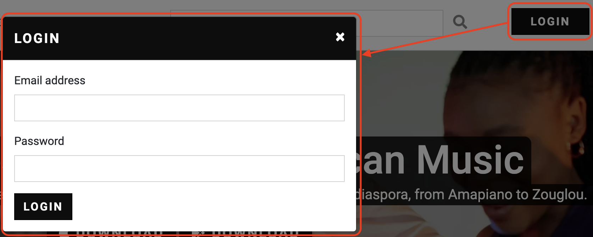
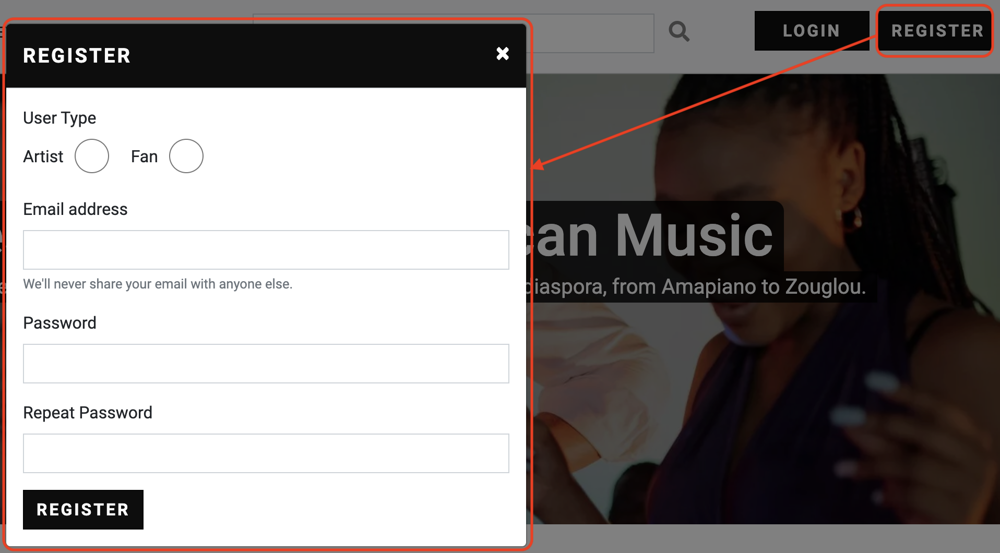

# AfrobeatsLib
(Developer: Femi Ashiru)

[Live Project](https://ofemiashiru.github.io/CI_MS1_ABL)

## Table of Content

1. [Project Goals](#project-goals)
    1. [User Goals](#user-goals)
    2. [Site Owner Goals](#site-owner-goals)
2. [User Experience](#user-experience)
    1. [Target Audience](#target-audience)
    2. [User Requrements and Expectations](#user-requrements-and-expectations)
    3. [User Stories](#user-stories)
    4. [Scope](#scope)
3. [Design](#design)
    1. [Design Choices](#design-choices)
    2. [Colour](#colour)
    3. [Fonts](#fonts)
    4. [Structure](#structure)
    5. [Wireframes](#wireframes)
4. [Technologies Used](#technologies-used)
    1. [Languages](#languages)
    2. [Frameworks and Tools](#frameworks-and-tools)
5. [Features](#features)
6. [Testing](#validation)
    1. [HTML Validation](#HTML-validation)
    2. [CSS Validation](#CSS-validation)
    3. [Accessibility](#accessibility)
    4. [Performance](#performance)
    5. [Device testing](#performing-tests-on-various-devices)
    6. [Browser compatibility](#browser-compatability)
    7. [Testing user stories](#testing-user-stories)
8. [Bugs](#Bugs)
9. [Deployment](#deployment)
10. [Credits](#credits)
11. [Acknowledgements](#acknowledgements)

## Project Goals 

### User Goals
- Link to the latest music from their favourite Afrobeats artists
- See the different options and costs for subscribing to AfrobeatsLib
- Browse artists by letter or genre
- Read latest news about everything relating to Afrobeats music
- See the latest Afrobeats events and link to their corresponding pages

### Site Owner Goals
- Have fans and artist subscribe to AfrobeatsLib
- Collect emails of visitors to grow AfrobeatsLib mailing list
- Enable visitors to contact AfrobeatsLib with queries relating to sales, technical issues etc.
- Provide a way for visitors to download the AfrobeatsLib app via the App store or Goolge Play store
- Prepare site to implement it's own in house music player (currently disabled)

## User Experience

### Target Audience
- People who are fans of Afrobeat music 
- Independent or major Artists who would like to upload their own music
- People who would like to be kept up to date with the most recent Afrobeat news and events

### User Requrements and Expectations

- Easy to use navigation that is responsive
- Be able to easily browse artists by genre or letter
- All links to work as expected
- Appealing design that works well on both desktop and mobile devices
- Be able to connect easily with events and news
- Be able to contact AfrobeatsLib in a simple way
- Gain information about the different subscriptions quickly and easily
- Accessibility 

### User Stories

#### First-time User 
1. I want to locate favourite artists by letter or genre
2. I want to know the different subscription prices
3. I want to see the latest events 
4. I want to see the latest news
5. I want to be able to download the AfrobeatsLib app from the App store or Google Play store
6. I want to be able to sign up to AfrobeatsLib
7. I want to sign up to AfrobeatsLib Mailing list

#### Returning User
8. I want to see all the latest events and be able to visit their corresponding pages
9. I want to see the latest featured albums and artists
10. I want to be able to contact AfrobeatsLib
11. I want to interact with AfrobeatsLib on their social media platform
12. I want to leave a comment on the news articles

#### Site Owner 
13. I want users to be able to find and listen to their favourite Afrobeats artists
14. I want users to be able to be kept up to date with latest events and news
15. I want users to be able to contact us
16. I want users to be able to download our app on App store and Google Play store
17. I want users to sign up to our mailing list
18. I want our site to be prepared to launch our own in house music player 

## Scope

The scope of the project in it’s first release is defined by the following features:

- Simple navigation that clearly shows the user what page they are currently on.  
- A footer on all pages that allows users to sign up to the mailing list and connect to social media platforms.
- A detailed section on the home page (index.html) that shows the pricing for subscribing to the websites services.
- Login and register links on all pages that display a modal to allow users to register or login.
- Artist (artists.html) and genre (genre.html) page that allows users to browse artists by letter or genre.
- Link to external YouTube site for each artists music, making sure that the page opens in a new tab/window. 
- Contact page with form to allow users to send queries. The form is functional and will not submit unless all fields are filled out.
- An error page (404.html) that directs users back to the previous page they were on if visiting a page that does not exist.
- An Events page (events.html) that allows users to see the latest events and navigate to their respective pages.
- A News page (news.html) that shows all the latest news.
- Google map embedded to display the location of the sites business office.
- Clear and simple favicon icon to help users identify the site.

Features to be built in future releases:

- In house music player, which is currently disabled, will be developed so that artist links will trigger the player instead of navigating to a YouTube link.
- Currently the comments form on each article navigates to a placeholder - this will be developed to display comments under each article.
- Search bar on navigation will be developed to help users quickly explore the catalogue of music on website.
- Develop login and register modals to store users details and subscription information in a database. This will also lead to a users account page being developed based on whether users are artists or fans.
- Mailing list form will successfully store visitors emails within a database for future alerts.

## Design

### Design Choices
AfrobeatsLib was designed to have a simple and sleek modern look that is able to compete with other streaming platforms on the market. It has modern edges with a simple colour scheme which also makes it easy for users to navigate throughout the site. As the site adopts the usage of a lot of images, it was important to make sure not to introduce too many colours for the scheme as it could potentially clash. The look of the site resembles high end music magazines with large images and minimal amounts of text.

### Colour

For the colour scheme I opted for a simple shade of black and off white colour using a chalk tone for the majority of the body text. The bright pink was chosen to give familiarity to Apple Music and TikTok platforms as a way of aligning to them as potential competitors.

### Fonts

The main body of the text uses Roboto with a fallback of sans-serif, however the brand text adopts the Bebas Neue font also with a fallback of sans-serif. The headings use a heavier font weight of Roboto throughout the site. Both fonts were imported using Google Fonts API.

### Structure
The website is structured to mimick the style of high end magazines with a simple top down, left to right flow of information. It is user friendly and has recognisable elements such as a fixed navigation bar along the top that consists of the business brand logo, menu for each page, search bar and login & register buttons. Each page is responsive in nature and has been tested on the industry standard width of 320px.

The website consists of 6 main pages:
- Home page which shows what the site is about, featured albums, and the various subscription options
- Artist page which allows users to browse the artist they want to listen to by letter and shows the top three featured artists
- Genre page which allows users to browse the artist they want to listen to by genre
- Events page which allows users to see the latest events and navigate to their corresponding sites
- News page which allows users to see and keep up with the latest news
- Contact page which allows users to contact the business and locate the office

### Wireframes

Home

Artists

Genre

- After meeting with Mentor during meeting two it was suggested that this design change as it was deemed too similar to the artists page. Hence the finished product adopts a different structure to the initial wireframe.
 

Events

News

News - Each Article

Contact

## Technologies Used

### Languages
- HTML
- CSS

### Frameworks and Tools
- Bootstrap v4.5
- Git
- GitHub
- Gitpod
- Ezgif.com
- Balsamiq
- Google Fonts
- Adobe Color
- Font Awesome
- Favicon.io

## Features

### Logo Navigation and Search bar
- Navigation and Logo remains consistent on each page
- Navigation is fully responsive and collapses when window is resized
- Navigation allows users to easily navigate from page to page
- Logo in Navigation takes user back to the home page
- Navigation also contains a search bar which will be an additional feature in future iterations of the site
- Navigation indicates to user what page they are currently on

### Login and Register Modals
- Allow users to login and/or register to AfrobeatsLib
- This will be a feature that will be developed in future iterations

## Hero Section
- Informs user of what the site is about
- Allows user to download app on App store or Google Play store (User story - 5, 16)

## Featured Albums and Artists
- Informs user of the latest feature albums and artists 

